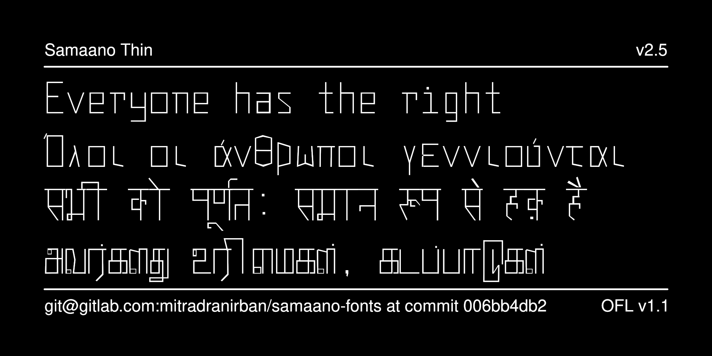
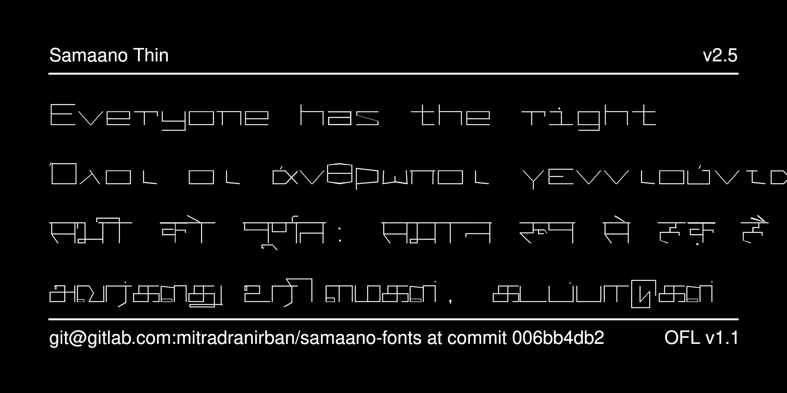

# Samaano Monospace Variable Weight Font

 
[![][Fontbakery]](https://mitradranirban.github.io/samaano-fonts/fontbakery/fontbakery-report.html)
[![][Universal]](https://mitradranirban.github.io/samaano-fonts/fontbakery/fontbakery-report.html)
[![][Font File]](https://mitradranirban.github.io/samaano-fonts/fontbakery/fontbakery-report.html)
[![][Repository]](https://mitradranirban.github.io/samaano-fonts/fontbakery/fontbakery-report.html)
[![][OpenType]](https://mitradranirban.github.io/samaano-fonts/fontbakery/fontbakery-report.html)

[Fontbakery]: https://img.shields.io/endpoint?url=https%3A%2F%2Fraw.githubusercontent.com%2Fmitradranirban%2Fsamaano-fonts%2Fgh-pages%2Fbadges%2Foverall.json
[Universal]: https://img.shields.io/endpoint?url=https%3A%2F%2Fraw.githubusercontent.com%2Fmitradranirban%2Fsamaano-fonts%2Fgh-pages%2Fbadges%2FUniversalProfileChecks.json
[Font File]: https://img.shields.io/endpoint?url=https%3A%2F%2Fraw.githubusercontent.com%2Fmitradranirban%2Fsamaano-fonts%2Fgh-pages%2Fbadges%2FFontFileChecks.json
[Repository]: https://img.shields.io/endpoint?url=https%3A%2F%2Fraw.githubusercontent.com%2Fmitradranirban%2Fsamaano-fonts%2Fgh-pages%2Fbadges%2FRepositoryChecks.json
[OpenType]: https://img.shields.io/endpoint?url=https%3A%2F%2Fraw.githubusercontent.com%2Fmitradranirban%2Fsamaano-fonts%2Fgh-pages%2Fbadges%2FOpenTypeSpecificationChecks.json

Samaano is an attempt to create a variable font using only Open Source Tools like Fontforge, Fontra and some shell script.
 

The Name Samaano comes fron the Hindi word Samaan , meaning equal indicating the spaces are equal in this font.
Indic fonts are usually not made monospaced, but the designer will use his experience with developing MitraMono, the first monospaced Bengali font made way back in 2002.

Following are the specialities of the font

* Fully created using Open Source Software - mainly [Fontra](https://fontra.xyz) and [Fontforge](https://github.com/fontforge/fontforge).

* Monospaced Font

* Three Variable axes of Weight, Width, and Slant

* Simple Glyph construction using Rectangular or quadrilateral components only

* Extensive coverage of many Latin Based Languages including East European Languages, Vietnamese and Devanagari.

## About
This font is created by Dr Anirban Mitra, an amateure Typographer and Free Software Enthusiast.
 
## Changelog
 
10 October 2024 - Version 1.000 - First Release

13 November 2024 - Version 2.000
  * Added additional axis of Slant

  * Added support for East European Latin based Languages Indic Translitteration and Vietnamese

  * Update Devanagari Open  Type Tables to version 2 with addition of GPOS features

Road Map for Version 3 

   * Addition of Greek, Cyrillic, Math and Tamil

## License

This Font Software is licensed under the SIL Open Font License, Version 1.1.
This license is available with a FAQ at [OpenFontLicense site](https://openfontlicense.org/)

 
