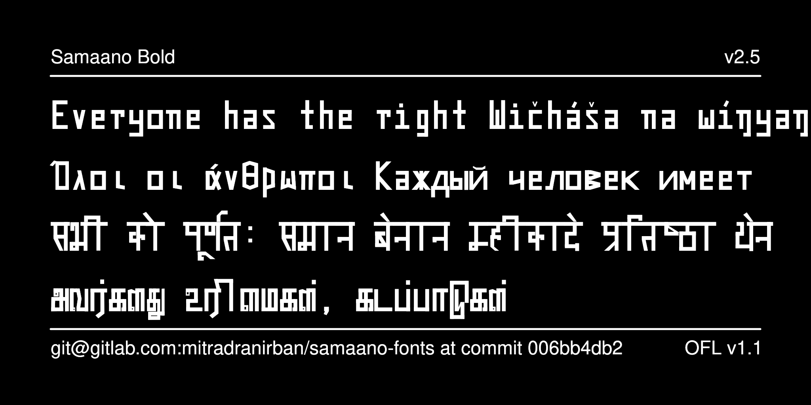

# Samaano Monospace Variable Weight Font

 
[![][Fontbakery]](https://mitradranirban.github.io/samaano-fonts/fontbakery/fontbakery-report.html)
[![][Universal]](https://mitradranirban.github.io/samaano-fonts/fontbakery/fontbakery-report.html)
[![][Font File]](https://mitradranirban.github.io/samaano-fonts/fontbakery/fontbakery-report.html)
[![][Repository]](https://mitradranirban.github.io/samaano-fonts/fontbakery/fontbakery-report.html)
[![][OpenType]](https://mitradranirban.github.io/samaano-fonts/fontbakery/fontbakery-report.html)

[Fontbakery]: https://img.shields.io/endpoint?url=https%3A%2F%2Fraw.githubusercontent.com%2Fmitradranirban%2Fsamaano-fonts%2Fgh-pages%2Fbadges%2Foverall.json
[Universal]: https://img.shields.io/endpoint?url=https%3A%2F%2Fraw.githubusercontent.com%2Fmitradranirban%2Fsamaano-fonts%2Fgh-pages%2Fbadges%2FUniversalProfileChecks.json
[Font File]: https://img.shields.io/endpoint?url=https%3A%2F%2Fraw.githubusercontent.com%2Fmitradranirban%2Fsamaano-fonts%2Fgh-pages%2Fbadges%2FFontFileChecks.json
[Repository]: https://img.shields.io/endpoint?url=https%3A%2F%2Fraw.githubusercontent.com%2Fmitradranirban%2Fsamaano-fonts%2Fgh-pages%2Fbadges%2FRepositoryChecks.json
[OpenType]: https://img.shields.io/endpoint?url=https%3A%2F%2Fraw.githubusercontent.com%2Fmitradranirban%2Fsamaano-fonts%2Fgh-pages%2Fbadges%2FOpenTypeSpecificationChecks.json

Samaano is an attempt to learn creation of variable font using Open Source Tools like Fontforge, Fontra and some python script.
 

The Name Samaano comes fron the Hindi word Samaan , meaning equal indicating the spaces are equal in this font.
Indic fonts are usually not made monospaced, but the designer will use his experience with developing MitraMono, the first monospaced Bengali font made way back in 2002.

Following are the specialities of the font

* Fully created using Open Source Software - mainly [Fontra](https://fontra.xyz) and [Fontforge](https://github.com/fontforge/fontforge).

* Monospaced Font

* Two Variable axes of Weight and Width

* Simple Glyph construction using Rectangular or quadrilateral components only

## About
This font is created by Dr Anirban Mitra, an amateure Typographer and Free Software Enthusiast.
 
## Changelog
 * Version 1.000beta - First Released for Beta testing on 07th October 2024 

## License

This Font Software is licensed under the SIL Open Font License, Version 1.1.
This license is available with a FAQ at [SIL site](https://scripts.sil.org/OFL)

 
