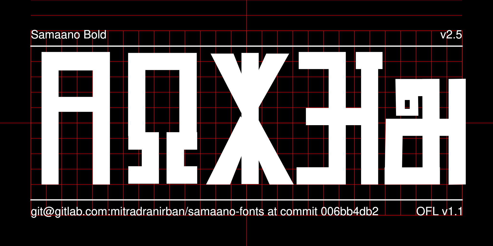

# Samaano Monospace Variable Weight Font

 
[![][Fontbakery]](https://mitradranirban.github.io/samaano-fonts/fontbakery/fontbakery-report.html)
[![][Universal]](https://mitradranirban.github.io/samaano-fonts/fontbakery/fontbakery-report.html)
[![][Font File]](https://mitradranirban.github.io/samaano-fonts/fontbakery/fontbakery-report.html)
[![][OpenType]](https://mitradranirban.github.io/samaano-fonts/fontbakery/fontbakery-report.html)

[Fontbakery]: https://img.shields.io/endpoint?url=https%3A%2F%2Fraw.githubusercontent.com%2Fmitradranirban%2Fsamaano-fonts%2Fgh-pages%2Fbadges%2Foverall.json
[Universal]: https://img.shields.io/endpoint?url=https%3A%2F%2Fraw.githubusercontent.com%2Fmitradranirban%2Fsamaano-fonts%2Fgh-pages%2Fbadges%2FUniversalProfileChecks.json
[Font File]: https://img.shields.io/endpoint?url=https%3A%2F%2Fraw.githubusercontent.com%2Fmitradranirban%2Fsamaano-fonts%2Fgh-pages%2Fbadges%2FFontFileChecks.json
[Repository]: https://img.shields.io/endpoint?url=https%3A%2F%2Fraw.githubusercontent.com%2Fmitradranirban%2Fsamaano-fonts%2Fgh-pages%2Fbadges%2FRepositoryChecks.json
[OpenType]: https://img.shields.io/endpoint?url=https%3A%2F%2Fraw.githubusercontent.com%2Fmitradranirban%2Fsamaano-fonts%2Fgh-pages%2Fbadges%2FOpenTypeSpecificationChecks.json

Samaano is an attempt to create a variable font using only Libre/Free/Open Source Tools like Fontforge, Fontra and some shell script.
 
The Name Samaano comes fron the Hindi word Samaan , meaning equal indicating the widths are equal in this font.
Indic fonts are usually not made monospaced, but the designer will use his experience with developing MitraMono, the first monospaced Bengali font made way back in 2002.

Following are the specialities of the font

* Fully created using Open Source Software - mainly [Fontra](https://fontra.xyz) and [Fontforge](https://github.com/fontforge/fontforge).

* Monospaced Font

* Three Variable axes of Weight, Width, and Slant

* Simple Glyph construction using Rectangular or quadrilateral components only

 
* Extensive coverage of many Latin Based Languages including African Languages and Vietnamese, Greek, Devanagari and Tamil.

Now, as per Shaperglot, Samaano supports ~~537~~  Latin based,16 Devanagari Based languages.  Monotonic and Polytonic Greek

[![][shaperglot]](documentation/samaano-shaperglot.png)
[shaperglot]: documentation/samaano-shaperglot.csv

## About

This font is created by Dr Anirban Mitra, an amateure Typographer and Free Software Enthusiast.
Following are some numbers associated with the of the typeface

*   0 - Zero Curves - Simple Glyph construction using Rectangular or quadrilateral components only
*   1 - Monospaced Typeface
*   3 - Three Variable axes of Weight, Width and Slant
*   ~3~ 4 - ~Three~ Four supported Scripts- Latin Extended, Devanagari, Greek and Tamil
*   9 - Font files, 8 Masters and 1 Variable
*   ~13~ 15 - supported glyphsets - ~4~ 6 by Adobe (Greek 1, Greek 2, Latin 1,Latin 2, Latin 3, Latin 4), 7 by Google fonts (Greek core, Latin Kernel, Latin Core, Latin Plus, Latin Vietnamese, Latin PriAfrican, Latin African), and 2 by Koeberlin (Latin S and M)
*   14 - named instances in stat table, 2 along slant axis, 5 along width, and 7 along weight.
*   70 - possible combinations of named instances
*   100 - Hundred percent created using Open Source Software - mainly [Fontra](https://fontra.xyz) and [Fontforge](https://github.com/fontforge/fontforge).
*   ~554~ 792 - Languages supported as per Shaperglot, 773 Latin based, 16 Devanagari Based, 2 Greek based and Tamil
*   ~1044~ 1517 - unicode codepoints covered
*   ~9982~ 13960 - glyphs drawn - considering all masters
 
## Changelog
 
#### 10 October 2024 - Version 1.000
 * First Release

#### 13 November 2024 - Version 2.000
  * Added additional axis of Slant

  * Added support for East European Latin based Languages, Indic Translitteration and Vietnamese

  * Update Devanagari Open  Type Tables to version 2 with addition of GPOS features

#### 20 March 2025 - Version 2.301
  * Added Monotonic Greek
  * Extended Latin to include panNigerian, Pinyin and DIN91379.
  * Addition of Arrows, Geometric shapes and Mathametical Operators
  *
#### July 2025 - Version 2.400
  * Extension of Latin to include most African languages.
  * Extension of Greek to include Polytonic variant.
  * Addition of Tamil.

#### Road Map for Version 3

* Addition of Cyrillic
* Further extension of Latin to support most Latin Based languages.

## License

This Font Software is licensed under the SIL Open Font License, Version 1.1.
This license is available with a FAQ at [OpenFontLicense site](https://openfontlicense.org/)

 
